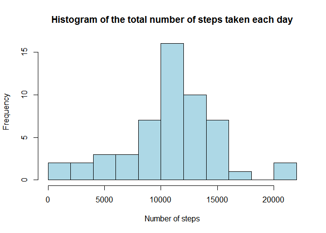

# Reproducible Research: Peer Assessment 1


## Loading and preprocessing the data
1. Load the data (i.e. read.csv())


```r
temp<-tempfile()
download.file("http://d396qusza40orc.cloudfront.net/repdata%2Fdata%2Factivity.zip", temp)
activity <- read.csv(unz(temp,"activity.csv"))
unlink(temp)
```

2. Process/transform the data (if necessary) into a format suitable for your analysis


```r
activity$date <- as.Date(activity$date)
df <- na.omit(activity)
```

## What is mean total number of steps taken per day?
1. Calculate the total number of steps taken per day


```r
steps_per_day <- aggregate(steps~date, data=df, sum)
```

2. Make a histogram of the total number of steps taken each day


```r
hist(steps_per_day$steps, breaks=15, col="lightblue", main="Histogram of the total number of steps taken each day", xlab="Number of steps")
```

 

3. Calculate and report the mean and median total number of steps taken per day


```r
mean(steps_per_day$steps)
```

```
## [1] 10766.19
```

```r
# Median:
median(steps_per_day$steps)
```

```
## [1] 10765
```

Mean: 10766.19
Median: 10765
 
## What is the average daily activity pattern?
1. Make a time series plot (i.e. type = "l") of the 5-minute interval (x-axis) and the average number of steps taken, averaged across all days (y-axis)
- Calculate average number of steps taken per 5 min interval

```r
steps_per_interval <- aggregate(steps~interval, data=df, mean)
```
- Plot

```r
require(ggplot2)
ggplot(steps_per_interval, aes(x=interval, y=steps)) + geom_line() + labs(title="Average daily activity pattern")
```

 

2. Which 5-minute interval, on average across all the days in the dataset, contains the maximum number of steps?

```r
index <- which.max(steps_per_interval[,"steps"])
steps_per_interval[index,]
```

```
##     interval    steps
## 104      835 206.1698
```

Interval 835th with 206.1698 steps

## Imputing missing values

1. Calculate and report the total number of missing values in the dataset (i.e. the total number of rows with NAs)


```r
nrow(activity[is.na(activity),])
```

```
## [1] 2304
```

2. Devise a strategy for filling in all of the missing values in the dataset. The strategy does not need to be sophisticated. For example, you could use the mean/median for that day, or the mean for that 5-minute interval, etc.

      Strategy: Use mean of 5-min interval to fill in missing values


3. Create a new dataset that is equal to the original dataset but with the missing data filled in.


```r
# New dataset copied from original dataset
new_activity<-activity
for(i in 1:nrow(activity)){
  if(is.na(activity$steps)[i]){
    curr_interval <- activity$interval[i]
    curr_steps <- steps_per_interval$steps[which(steps_per_interval$interval==curr_interval)]
    new_activity$steps[i]<-curr_steps
  }
}

# Double check if there is any missing value in the newly created dataset
nrow(activity[is.na(new_activity),])
```

```
## [1] 0
```

4. Make a histogram of the total number of steps taken each day and Calculate and report the mean and median total number of steps taken per day. Do these values differ from the estimates from the first part of the assignment? What is the impact of imputing missing data on the estimates of the total daily number of steps?


```r
new_steps_per_day <- aggregate(steps~date, data=new_activity, sum)
hist(new_steps_per_day$steps, breaks=15, col="lightblue", main="Histogram of the total number of steps taken each day", xlab="Number of steps")
```

 


```r
mean(new_steps_per_day$steps)
```

```
## [1] 10766.19
```

```r
median(new_steps_per_day$steps)
```

```
## [1] 10766.19
```
Mean: 10766.19
Median: 10766.19

New mean is the same as the old mean, new median is very slightly higher.

## Are there differences in activity patterns between weekdays and weekends?
1. Create a new factor variable in the dataset with two levels - "weekday" and "weekend" indicating whether a given date is a weekday or weekend day.


```r
new_activity$day<-weekdays(new_activity$date, abbreviate = T)
new_activity$day<-ifelse(new_activity$day=="Sun"|new_activity$day=="Sat", "weekend", "weekday")
```
2. Make a panel plot containing a time series plot (i.e. type = "l") of the 5-minute interval (x-axis) and the average number of steps taken, averaged across all weekday days or weekend days (y-axis). See the README file in the GitHub repository to see an example of what this plot should look like using simulated data.


```r
average_steps<-aggregate(steps~interval+day, data=new_activity, mean)

library(ggplot2)
ggplot(average_steps, aes(x=interval, y=steps)) + 
  geom_line() + 
  facet_grid(day~.) +
  labs(title="Average number of steps taken", x="5-min interval", y="number of steps")
```

 
